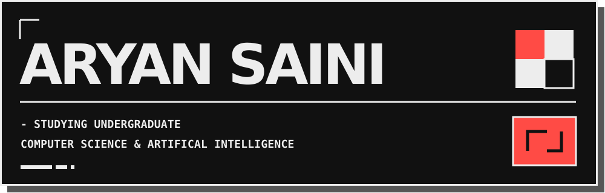

  

  <a href="https://github.com/sxuce?tab=repositories">Explore my repositories</a>
  &nbsp; / &nbsp;
  <a href="https://charles-mills.github.io/ChemSpec/">Try ChemSpec</a>
  &nbsp; / &nbsp;
  <a href="https://github.com/sxuce/sony-ch720n-control/releases">Get CH720 Control</a>

### A little about me

Hey, I'm **Aryan**, a developer based in the **United Kingdom**. I build things that turn an idea into something you can actually use — from controlling headphones on Linux to exploring chemistry in 3D.

My projects span native desktop tools, web apps, and experiments with code. My C# chat application started as my **A-level Computer Science NEA**.

### My toolkit

  

### Things I've worked on

| Project | What it does | Built with |
| :--- | :--- | :--- |
| **[ChemSpec](https://github.com/charles-mills/ChemSpec)** | Explore chemical reactions, follow changes atom by atom, and see the outcome in 3D. Built for OpenAI Build Week 2026. | `Rust` |
| **[CH720 Control](https://github.com/sxuce/sony-ch720n-control)** | Control Sony WH-CH720N headphones directly over Bluetooth on Linux — noise cancellation, ambient sound, EQ, and more. | `Rust` · `Linux` |
| **[Chat Application](https://github.com/sxuce/Chat-Application)** | A chat application I built for my **A-level Computer Science NEA**. | `C#` |

ChemSpec's web demo requires WebGPU support; the desktop app is available from its <a href="https://github.com/charles-mills/ChemSpec/releases">releases</a>.

---

  <samp>build something useful. learn something new. repeat.</samp>

